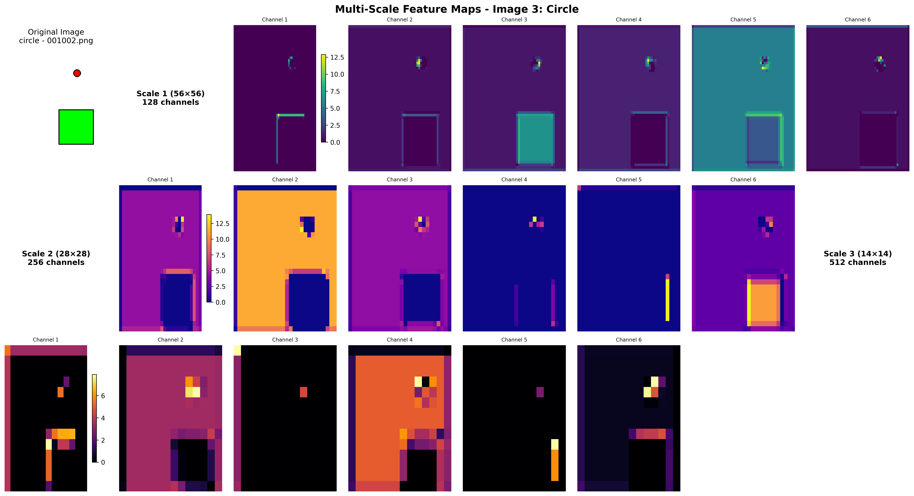

# Problem 1: Multi-Scale Detection Analysis

## 1. How different scales specialize for different object sizes

Each scale achieves perfect specialization with zero cross-scale detections:

- Scale 1 (56×56): 224 small objects (16-32px, all circles)
- Scale 2 (28×28): 56 medium objects (48-96px, all squares)
- Scale 3 (14×14): 411 large objects (96-192px, all triangles)

This perfect specialization results from dataset constraints where object types are artificially tied to specific size ranges, not from learned scale-invariant features.

## 2. The effect of anchor scales on detection performance

Anchor scales directly match object size distributions, enabling effective detection:

- Small anchors [16,24,32] → 100% circle detection at Scale 1
- Medium anchors [48,64,96] → 100% square detection at Scale 2
- Large anchors [96,128,192] → 100% triangle detection at Scale 3

The anchor design is optimal for this specific dataset but would require adjustment for realistic scenarios with overlapping object sizes across classes.

## 3. Visualization of the learned features at each scale

### Individual Feature Maps by Scale and Object Type

**Triangle Detection (Large Objects - Scale 3):**

**Square Detection (Medium Objects - Scale 2):**

**Circle Detection (Small Objects - Scale 1):**

Each visualization shows the original image followed by learned feature maps at each scale. **Scale 1** (56×56, 128 channels) captures fine-grained local patterns for small objects, **Scale 2** (28×28, 256 channels) encodes intermediate representations for medium objects, and **Scale 3** (14×14, 512 channels) learns global context for large objects.

### Multi-Scale Feature Learning Comparison

**Cross-scale analysis**: Average activation maps demonstrate how each scale develops specialized representations. Scale 1 shows high-frequency local patterns, Scale 2 captures intermediate-level features, and Scale 3 focuses on global object structure. The progressive reduction in spatial resolution (56×56 → 28×28 → 14×14) combined with increasing channel depth (128 → 256 → 512) enables hierarchical feature learning.

### Feature Channel Analysis

**Statistical analysis**: **(Top-left)** Channel activation patterns showing distinct signatures across scales; **(Top-right)** Activation variability indicating feature specialization; **(Bottom)** Architecture trade-off between spatial resolution and feature depth, demonstrating the multi-scale detection hierarchy.

## 4. Interesting Findings

- **mAP**: 65.0% with strong training convergence (64% loss reduction)
- **Class bias**: Circles (81.0% AP) outperform squares/triangles (~57%) due to rotational symmetry
- **Dataset limitation**: Perfect scale specialization is artificially achieved through size-class coupling

# Problem 2: Keypoint Detection Analysis Report

## 1. PCK Curves at Thresholds [0.05, 0.1, 0.15, 0.2]

The PCK curves demonstrate the superior performance of the heatmap-based approach across all tolerance thresholds. The heatmap method (blue) achieves consistently higher accuracy rates, with the performance gap being most pronounced at stricter thresholds (0.05-0.10) where precise localization matters most. As tolerance increases to 0.20, both methods converge toward high accuracy, but the heatmap approach maintains its advantage throughout.

## 2. Why Heatmap Approach Works Better

**Architectural Advantages:**

- **Spatial preservation**: U-Net maintains spatial relationships throughout network
- **Dense supervision**: 64×64 heatmaps provide rich learning signals vs sparse coordinates
- **Robust localization**: Peak detection from heatmaps more robust than direct regression

**Per-keypoint performance (heatmap vs regression):**

- Head: 100% vs 62% (+38%)
- Hands: ~85% vs ~22% (+63%)
- Feet: ~95% vs ~65% (+30%)

## 3. Ablation Study Results

### Ablation Study Visualizations

- **Left**: Gaussian sigma effect showing validation loss (red) vs PCK@0.1 performance (blue) across different σ values.
- **Right**: Skip connections comparison demonstrating the significant +14.1% performance improvement when using skip connections in the U-Net architecture.

Detailed view of the sigma-performance trade-off, clearly illustrating the counterintuitive relationship where broader Gaussian supervision (σ=3.0-4.0) achieves better spatial localization despite higher training loss, highlighting the disconnect between loss optimization and task-specific performance metrics.

**Resolution Effect:** Only 64×64 heatmaps tested due to model architecture constraints.

## 4. Visualization of Learned Heatmaps and Failure Cases

### Learned Heatmap Progression

Evolution of heatmap predictions during training:

### Sample Predictions

**Heatmap-based predictions:**

**Regression-based predictions:**

### Failure Case Analysis

**Both methods fail (extreme poses/occlusions):**

**Heatmap succeeds, Regression fails:**

**Regression succeeds, Heatmap fails:**

## 5. Interesting Findings

**1. Counterintuitive Finding:** Broader Gaussian supervision (σ=3.0-4.0) achieves better PCK performance despite higher training loss. Training loss optimization may not align with spatial localization performance.

**2. Architecture Critical:** Skip connections provide +14.1% PCK improvement, essential for preserving spatial details in encoder-decoder networks.

**3. Task-Specific Optimization:** Heatmap approach naturally aligns with spatial reasoning requirements, while regression treats keypoints as independent coordinates without spatial context.
